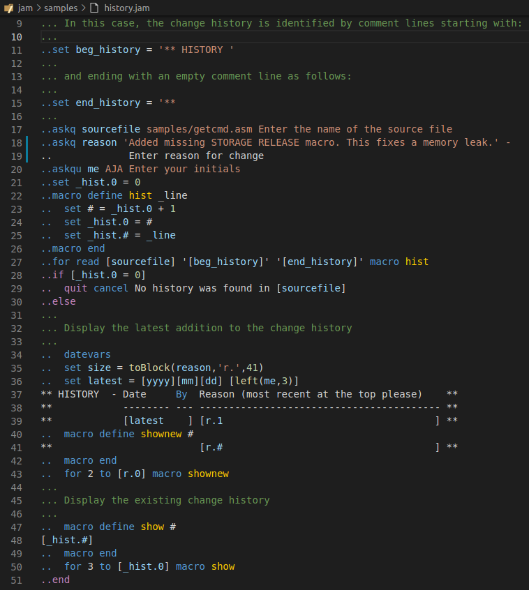

# JAMZ Syntax Highlighter README

This is a syntax highlighter extension for the [JAMZ (Just Another Macro language for z/OS processor](https://github.com/abend0c1/jam)). 

## Features

- Highlights JAMZ processor statements
- Highlights embedded REXX language statements

Example showing highlighted JAMZ statements (which are prefixed by `..`) and 
embedded REXX expressions (which are enclosed by `[` and `]`):

## Requirements

- If you want to actually run the JAMZ processor (on z/OS, Linux or Windows) you will need to clone the JAMZ processor repository from Github and follow the installation instructions in the README.

  https://github.com/abend0c1/jam

- If you want JAMZ syntax highlighting in VSCode (when editing .jam or .jamz files) then install this extension.

- If you also want embedded REXX syntax highlighting in VSCode then you will need to install
  a suitable REXX highlighter extension from the VSCode Marketplace (press `Ctrl+Shift+X` and type `rexx` into the search box).

## Known Issues

- JAMZ keywords are erroneously highlighted when present inside quoted strings.

## Release Notes

- None.

### 1.0.0

Initial release of JAMZ syntax highlighter.
